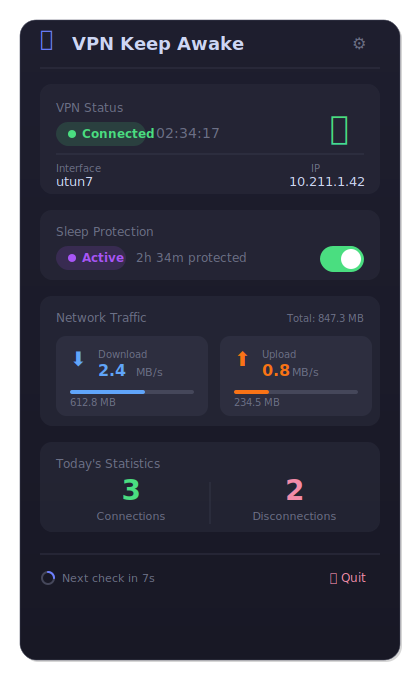
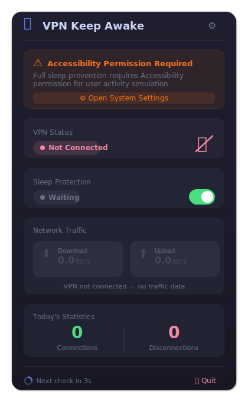
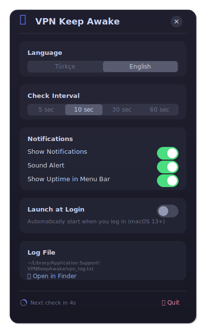

# VPN Keep Awake

**[TR]** macOS menu bar uygulaması — VPN bağlantısı aktifken bilgisayarın uyku moduna girmesini engeller.

**[EN]** macOS menu bar app — prevents your Mac from sleeping while a VPN connection is active.

> **Why this app?** FortiClient VPN on macOS has a long-standing issue where the SSL VPN connection silently drops when the Mac enters sleep mode. Upon waking, FortiClient often fails to reconnect automatically — or worse, appears connected while the tunnel is actually dead. This forces users to manually disconnect and reconnect, disrupting remote work sessions. VPN Keep Awake was built specifically to solve this problem. While it was born from the FortiClient frustration, it works with **any VPN client** that uses standard macOS network interfaces.
>
> **Neden bu uygulama?** FortiClient VPN'in macOS'ta bilinen bir sorunu var: Mac uyku moduna girdiğinde SSL VPN bağlantısı sessizce kopuyor. Uyandıktan sonra FortiClient genellikle otomatik bağlanamıyor — ya da bağlıymış gibi görünüp tünel aslında ölü oluyor. Bu durum kullanıcıları sürekli elle bağlantı kesip yeniden bağlanmaya zorluyor. VPN Keep Awake tam olarak bu sorunu çözmek için geliştirildi. FortiClient kaynaklı bir ihtiyaçtan doğmuş olsa da, standart macOS ağ arayüzlerini kullanan **tüm VPN istemcileriyle** çalışır.


---

## Screenshots / Ekran Görüntüleri

<p align="center">
  
  &nbsp;&nbsp;
  
</p>

<p align="center">
  
  &nbsp;&nbsp;
</p>

---

## Features / Özellikler

| EN | TR |
|---|---|
| **VPN Detection** — Auto-detects PPP, utun, IPSec, TUN, TAP interfaces (IPv4 validated) | **VPN Algılama** — PPP, utun, IPSec, TUN, TAP interface'lerini otomatik algılar |
| **Multi-VPN Support** — Shows all active VPN connections simultaneously | **Çoklu VPN Desteği** — Birden fazla VPN bağlantısını aynı anda gösterir |
| **3-Layer Sleep Prevention** — IOPMAssertion + Display Assertion + User activity simulation | **3 Katmanlı Uyku Engelleme** — IOPMAssertion + Display Assertion + Kullanıcı aktivitesi simülasyonu |
| **Floating Dashboard** — Modern UI with glass morphism effects | **Floating Dashboard** — Glass morphism efektli modern arayüz |
| **Menu Bar Uptime** — Shows VPN uptime in menu bar (toggleable) | **Menü Bar Uptime** — VPN bağlantı süresi menü bar'da gösterilir (açılıp kapanabilir) |
| **Network Traffic** — Real-time download/upload speed and total data | **Ağ Trafiği** — Anlık indirme/yükleme hızı ve toplam veri transferi |
| **Notifications** — macOS native notifications and sound alerts | **Bildirimler** — macOS native bildirimler ve sesli uyarı |
| **Launch at Login** — One-click Login Items toggle (macOS 13+) | **Başlangıçta Açılma** — Tek tıkla Login Items'a ekleme (macOS 13+) |
| **Quit Confirmation** — Prevents accidental closure | **Çıkış Onayı** — Yanlışlıkla kapatmayı önler |
| **Accessibility Check** — Warns and guides if permission is missing | **Erişilebilirlik Kontrolü** — İzin yoksa uyarı ve yönlendirme |
| **Turkish / English** — Switch language instantly from settings | **Türkçe / İngilizce** — Ayarlardan anında dil değişimi |
| **Dark / Light Mode** — Adapts to macOS theme automatically | **Dark / Light Mode** — macOS temasına otomatik uyum |

---

## Installation / Kurulum

### Download / İndirme

1. Download the latest `VPNKeepAwake.app.zip` from [Releases](https://github.com/softviser/VPNKeepAwake/tree/main/Releases)
2. Extract the ZIP file / ZIP dosyasını açın
3. Drag `VPNKeepAwake.app` to `/Applications` folder
4. Double-click to launch / Çift tıklayarak açın

> **Note / Not:** On first launch, macOS may show an "unidentified developer" warning. Right-click → Open → Click "Open". Or go to **System Settings > Privacy & Security** and click "Open Anyway".
>
> İlk açılışta macOS "tanınmayan geliştirici" uyarısı gösterebilir. Sağ tık → Aç → "Aç" butonuna tıklayın. Veya **System Settings > Privacy & Security** altından "Yine de Aç" seçeneğini kullanın.

### Build from Source / Kaynaktan Derleme

```bash
# Requirements: macOS 10.15+, Xcode Command Line Tools
xcode-select --install

git clone https://github.com/softviser/VPNKeepAwake.git
cd VPNKeepAwake
./build.sh

# Run
open build/VPNKeepAwake.app

# Install to Applications (optional)
cp -r build/VPNKeepAwake.app /Applications/
```

### Create DMG / DMG Oluşturma

```bash
./create-dmg.sh
# Output: dist/VPNKeepAwake-1.2.0.dmg
```

### Launch at Login / Başlangıçta Otomatik Çalıştırma

Enable "Launch at Login" toggle from the Settings panel (macOS 13+).

Ayarlar panelinden "Başlangıçta Otomatik Aç" toggle'ını açın (macOS 13+).

---

## Permissions / İzinler

### Accessibility / Erişilebilirlik

Full sleep prevention requires Accessibility permission. The app shows a warning banner on the dashboard if permission is not granted.

Tam uyku engelleme için Erişilebilirlik izni gereklidir. İzin yoksa dashboard'da uyarı gösterilir.

**System Settings > Privacy & Security > Accessibility** → Enable VPN Keep Awake

> Without permission, partial protection is still active (IOPMAssertion). With permission, user activity simulation is also enabled.
>
> İzin olmadan kısmi koruma sağlanır. İzin ile ek olarak kullanıcı aktivitesi simülasyonu devreye girer.

---

## Supported VPN Types / Desteklenen VPN Türleri

- **FortiClient SSL VPN** (primary target / ana hedef)
- OpenVPN
- Cisco AnyConnect
- IPSec VPN
- WireGuard
- Any ppp/utun/tun/tap based VPN / Diğer tüm ppp/utun/tun/tap tabanlı VPN'ler

> **FortiClient users / FortiClient kullanıcıları:** If you're experiencing VPN drops after macOS sleep, this app is made for you. Just install, keep it running, and forget about it — your VPN session will stay alive as long as FortiClient is connected.
>
> FortiClient ile macOS uyku sonrası VPN kopma sorunu yaşıyorsanız, bu uygulama tam size göre. Kurun, arka planda çalışsın, gerisini unutun — FortiClient bağlı olduğu sürece VPN oturumunuz ayakta kalır.

---

## How It Works / Nasıl Çalışır?

1. **VPN Detection**: Periodically scans network interfaces (default 10s). Interfaces with `ppp`, `utun`, `ipsec`, `tun`, `tap` prefix **and a valid IPv4 address** are detected as VPN. System utun interfaces (iCloud Private Relay etc.) are filtered out.

2. **Sleep Prevention** (3 layers):
   - `kIOPMAssertPreventUserIdleSystemSleep` — System sleep assertion
   - `kIOPMAssertPreventUserIdleDisplaySleep` — Display sleep assertion
   - `IOPMAssertionDeclareUserActivity` + mouse micro-movement (every 60s) — User activity simulation

3. **On VPN disconnect**: All assertions are released, activity simulation stops, notification is sent.

---

## Settings / Ayarlar

| Setting / Ayar | Options / Seçenekler | Default / Varsayılan |
|---|---|---|
| Check Interval / Kontrol Aralığı | 5, 10, 30, 60 sec | 10 sec |
| Notifications / Bildirimler | On / Off | On |
| Sound Alert / Sesli Uyarı | On / Off | On |
| Menu Bar Uptime | On / Off | On |
| Launch at Login / Başlangıçta Aç | On / Off | Off |
| Language / Dil | Türkçe / English | Türkçe |

Settings are stored via `UserDefaults`.

---

## Log File

```
~/Library/Application Support/VPNKeepAwake/vpn_log.txt
```

---

## Technical Details / Teknik Detaylar

- **Language**: Swift 5+
- **UI**: SwiftUI + AppKit hybrid (NSHostingView embedded in NSPanel)
- **Architecture**: Single file (`Sources/main.swift`), organized with MARK sections
- **Binary**: Universal (Intel + Apple Silicon)
- **Build**: Direct `swiftc` compilation, no Xcode project
- **Packaging**: `.app` bundle (build.sh) or `.dmg` (create-dmg.sh)

---

## License / Lisans

MIT License — See [LICENSE](LICENSE) for details.

## Developer / Geliştirici

**Softviser** — [www.softviser.com.tr](https://www.softviser.com.tr)
